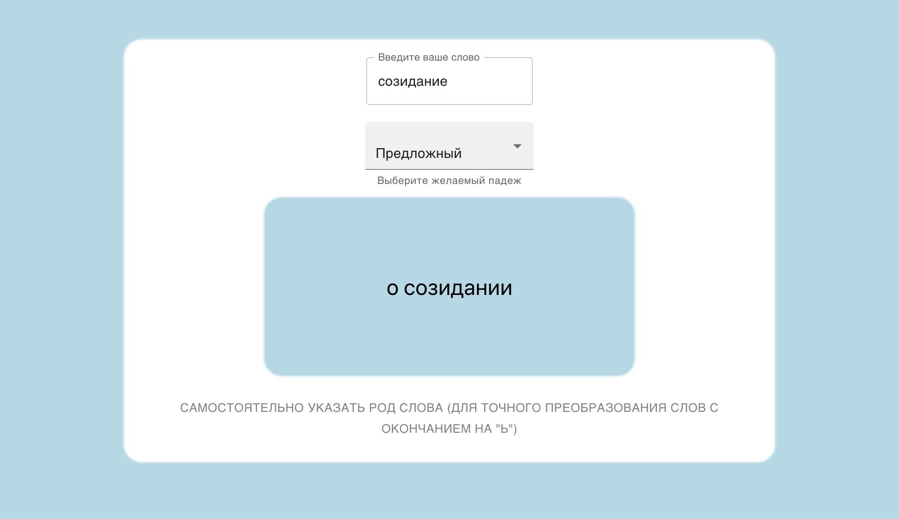

<h1> Noun-Declinator </h1>

App that declines Russian nouns to 6 cases, built for hackathon onboarding

Demo: https://noun-declinator.vercel.app

<h2> Screenshots: </h2>



<h2> To run locally: </h2>
 
```
git clone git@github.com:100whitebirds/noun-declinator.git
```
```
npm install
```
```
npm start
```
